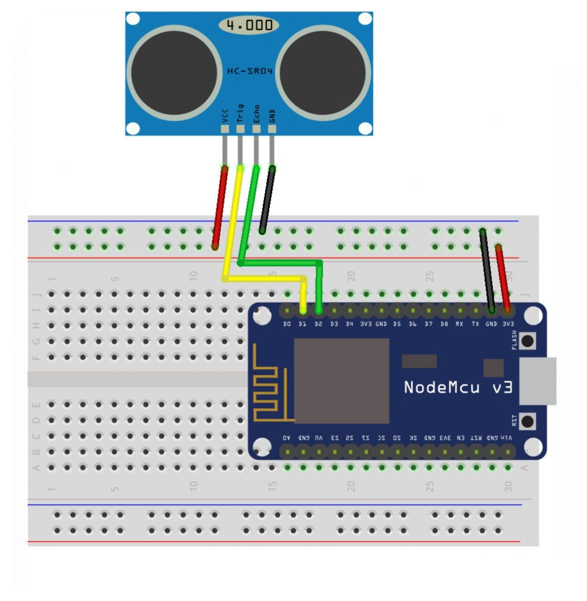
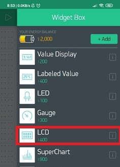
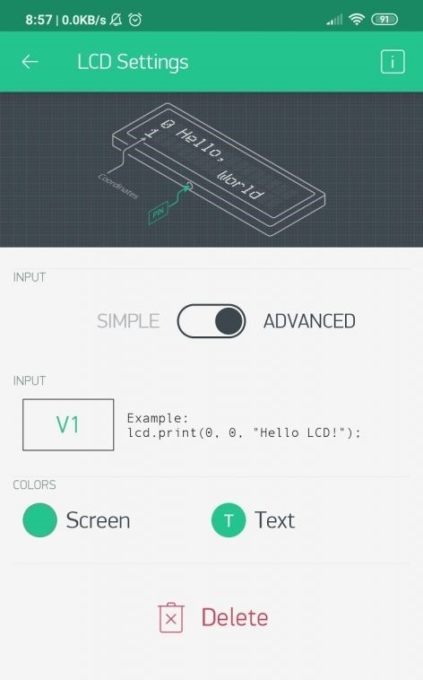
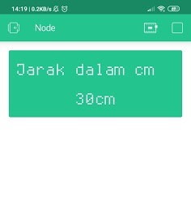

# BLYNK IoT Water Tank Height Monitoring

## Description:

- HC-SR04 is an ultrasonic sensor module that is usually used for distance measuring devices. In HC-SR04 there is a pair of ultrasonic transducers, one functions as a transmitter that is responsible for converting electrical signals into ultrasonic sound wave pulse signals with a frequency of 40KHz, and the other functions as a receiver that is responsible for receiving ultrasonic sound wave signals. If the HC-SR04 Sensor is connected to an IoT device, the data obtained can be processed and displayed anywhere.

## Component (Tools & Materials):

- NodeMCU ESP8266 = 1 unit;
- Sensor HC-SR04 = 1 unit;
- Wired.

## Circuit Schematic:

 <br/>

## BLYNK Settings:

- Use LCD type Widget Box. <br/>
   <br/>
- LCD Widget Box selection image.<br>

- In LCD Settings, select Advance mode and select Virtual V1 pin.<br/>
   <br/>
- LCD Setting Image. <br/>

## Interface:

 <br/>

- BLYNK Water Tank Height Monitoring Interface Image. <br/>

## Sketch Code Program:

```cpp
#define BLYNK_PRINT Serial
#include &lt;ESP8266WiFi.h&gt;
#include &lt;BlynkSimpleEsp8266.h&gt;
#define TRIGGERPIN D1
#define ECHOPIN D2

char auth[] = "XXXX";
char ssid[] = "Veendy-Suseno";
char pass[] = "Admin12345";
WidgetLCD lcd(V1);

void setup() {
    Serial.begin(9600);
    pinMode(TRIGGERPIN, OUTPUT);
    pinMode(ECHOPIN, INPUT);
    Blynk.begin(auth, ssid, pass);
    lcd.clear();
    lcd.print(0, 0, "Jarak dalam cm");
}

void loop() {
    lcd.clear();
    lcd.print(0, 0, "Jarak dalam cm");
    long duration, distance;
    digitalWrite(TRIGGERPIN, LOW);
    delayMicroseconds(3);
    digitalWrite(TRIGGERPIN, HIGH);
    delayMicroseconds(12);
    digitalWrite(TRIGGERPIN, LOW);
    duration = pulseIn(ECHOPIN, HIGH);
    distance = (duration / 2) / 29.1;
    Serial.print(distance);
    Serial.println("Cm");
    lcd.print(7, 1, distance);
    Blynk.run();
    delay(3500);
}

```

## Conclusion:

- In this project, NodeMCU is connected to the Blynk application wirelessly used to read the HC-SR04 sensor for monitoring the height of the water tank. In the Blynk application there is an LCD that shows the distance between the water and the sensor.
